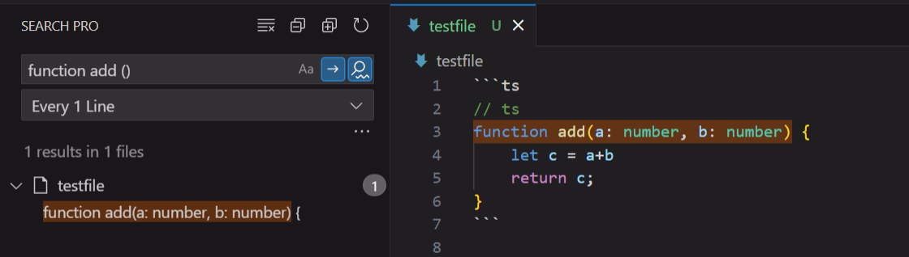
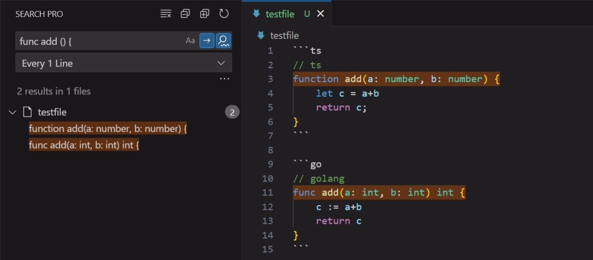
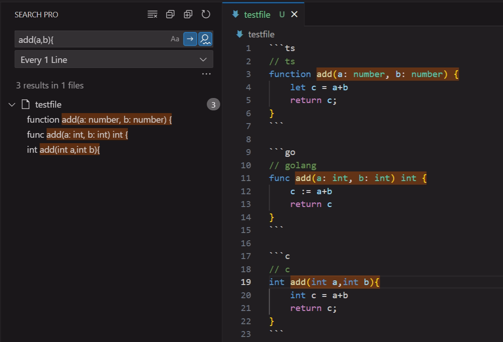
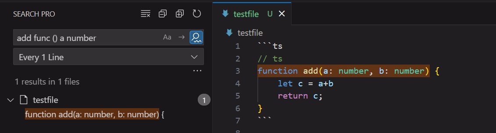
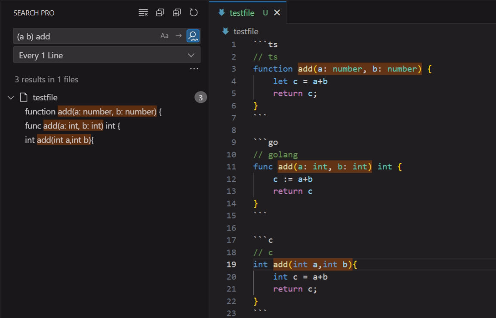
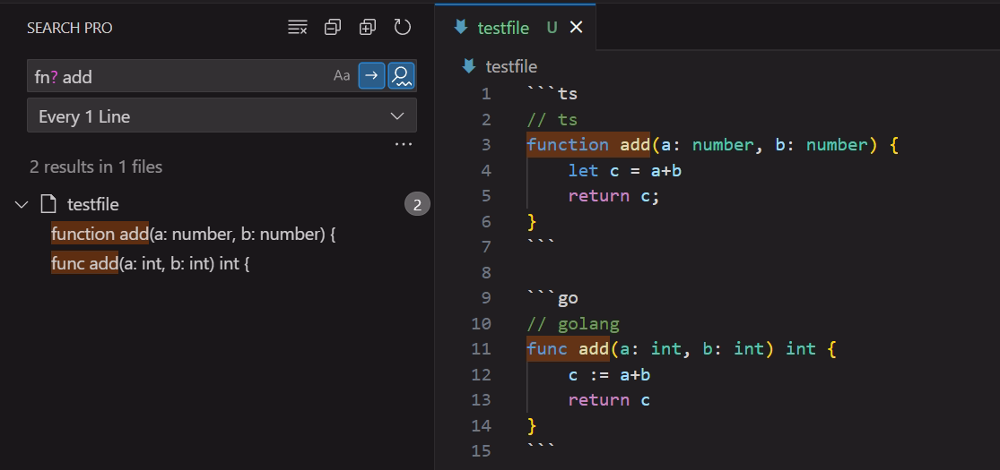

# A powerful fuzzy search tool for VSCode

## Quick Start

### In-order Search:
<p align="left">

<br/>

<br/>

</p>

### MultiLine In-order Search:
<p align="left">

</p>

### Not-order Search:
<p align="left">

<br/>

</p>

### Fuzzy Search: (end with ?)
<p align="left">

</p>


### test text:

```ts
// ts
function add(a: number, b: number) {
	let c = a+b
	return c;
}
```

```go
// golang
func add(a: int, b: int) int {
	c := a+b
	return c
}
```

```c
// c
int add(int a,int b){
	int c = a+b
	return c;
}
```

## License
[MIT](LICENSE)
